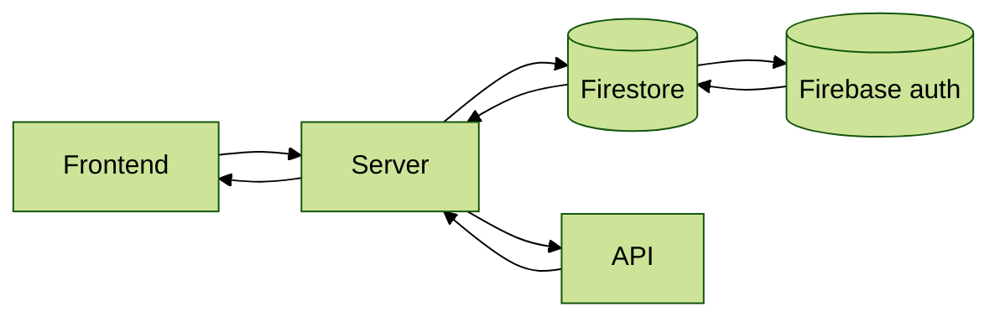
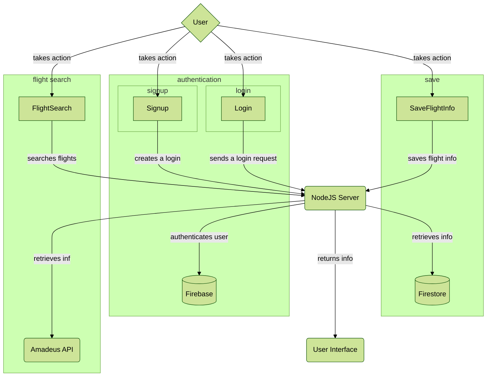
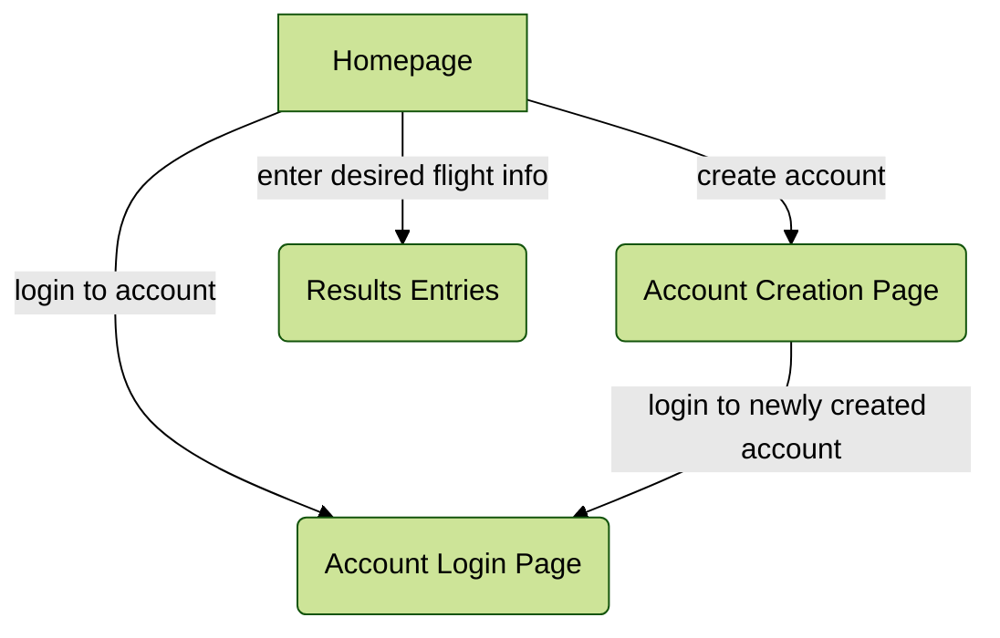

# Hello World 
1. [Software Overview](#software-overview)
2. [Requirements and Prerequisites](#requirements-and-prerequisites)
   1. [Compatible Operating Systems](#compatible-operating-systems)
   2. [Supported Web Browsers](#supported-web-browsers)
   3. [System Requirements](#system-requirements)
   4. [Library Requirements](#library-requirements)
      1. [Frontend](#frontend)
      2. [Backend](#backend)
   5. [Key Requirements](#key-requirements)
      1. [Firebase Key](#firebase-key)
      2. [Amadeus API Key](#amadeus-api-key)
3. [Installation and Development](#installation-and-development)
   1. [Development](#development)
4. [Design Diagrams](#design-diagrams)
   1. [High Level Systems Diagram](#high-level-systems-diagram)
   2. [Use Case Diagram](#use-case-diagram)
   3. [Frontend Webpages](#frontend-webpages)
---
## Preview


## Software Overview

HelloWorld is a web application that retrieves the cheapest flight option based on users’ desired flight characteristics. The current supported list of flight characteristics include:
- origin and destination 
- one-way vs. round-trip
- number of travelers
- cabin class
- departure date and return date. 

\* Our software allows users to enter multiple origin locations and destination locations. Our software provides users the option to bundle various groups together in a **preset** and tie those customized presets to their account. <div id='highlight-feature'/> 

Search feature allows users to toggle various origin and destination locations manually, or autofill the flight search interface with the locations presets tied to their account for ease of use. Based on the information the user provides, our software makes calls to the Amadeus Flight API and sorts the flights returned. We sort from lowest to highest price per flight duration. Each itinerary results reflects the users' inputs in the optimal sorting order (metrics is price/flight duration). The current supported list of each itinerary result include:
- total travel time
- layover information (duration, time stamps)
- airline carriers

With our software, users are able to sift through results returned to them and see flight numbers for each flight to allow them to lookup that flight on a flight purchasing website at ease. 

---

## Requirements and Prerequisites

### Compatible Operating Systems
Most modern operating systems (Windows, MacOS, Linux, etc.) with web browser

### Supported Web Browsers
All modern browsers (Edge, Firefox, Chrome, Safari, etc.)

### System Requirements
- Server environment: [Node.js](https://nodejs.org/en/download)
- Package manager: `npm` (preferred and included when you install Node)
- Version control: [git](https://git-scm.com/book/en/v2/Getting-Started-Installing-Git)

### Library Requirements
All dependencies with their versions are listed in the metadata/configuration files in our project (backend dependencies [here](/backend/server/package.json), frontend dependencies [here](/frontend/package.json)). Important requirements are listed below:
#### Frontend
- [Material UI](https://www.npmjs.com/package/@mui/material)
- [React](<https://www.npmjs.com/package/react>)
- [React Router DOM](<https://www.npmjs.com/package/react-router-dom>)
- [Firebase](<https://www.npmjs.com/package/firebase>)
- [Dayjs](<https://www.npmjs.com/package/dayjs>)
#### Backend
- [Amadeus](<https://www.npmjs.com/package/amadeus>)
- [Express](<https://www.npmjs.com/package/express>)
- [GraphQL](<https://www.npmjs.com/package/graphql>)
- [Firebase SDK for Cloud Functions](https://www.npmjs.com/package/firebase-functions)

### Key Requirements

To ensure the proper functionality of this project, you must configure the following keys:

#### Firebase Key

For Firestore and Firebase Authentication, you need to set up your Firebase project and obtain your unique Firebase key. Follow these steps:

1. Go to the [Firebase Console](https://console.firebase.google.com/).
2. Create a new project or select an existing one.
3. Navigate to the project settings and find your Web API Key.
4. Place this key in your frontend/Firebase folder.

#### Amadeus API Key

This project uses the Amadeus API to search for flights. You will need to obtain your API key by following these steps:

1. Sign up for an account at [Amadeus for Developers](https://developers.amadeus.com/).
2. Create a new application within your dashboard to receive your API credentials.
3. You'll receive an API Key and API Secret—both of which you'll need to use the Amadeus services.
4. Add the API Key and Secret to your backend/Amadeus folder.


---
## Installation and Development
### Development
First, ensure your [operating system](#compatible-operating-systems), and [web browser](#supported-web-browsers) requirements are met.

Second, install `Node.js` and `npm` with [the appropriate installer](https://nodejs.org/en/download) to your OS. *Development of this project is done using Node v18.14.1 and npm v9.3.1*

Third, navigate to your directory of choice. Clone the repo and navigate there with 
``` bash
git clone https://github.com/tvay11/helloworld.git && cd helloworld
```

Within the `helloworld` directory, navigate to the frontend folder and install its dependencies locally [^install]
```bash
cd frontend && npm install
```
Return to project root in `helloworld` and navigate to backend folder and install its dependencies locally [^install]
```bash
cd ../backend/server/ && npm install
```
[^install]: *It is recommended to install dependencies locally to avoid version incompatibility with your other projects.*

### Preferred Way to Compile
Once within `HelloWorld` folder...
- To run frontend, `cd frontend` and then run `npm start`
- To run backend server, `cd backend/server` and then run `npm run dev`

---

## Design Diagram  <div id='design'/>
### High Level Systems Diagram (View in Light Mode)



### Use Case Diagram


### Frontend Webpages

---


